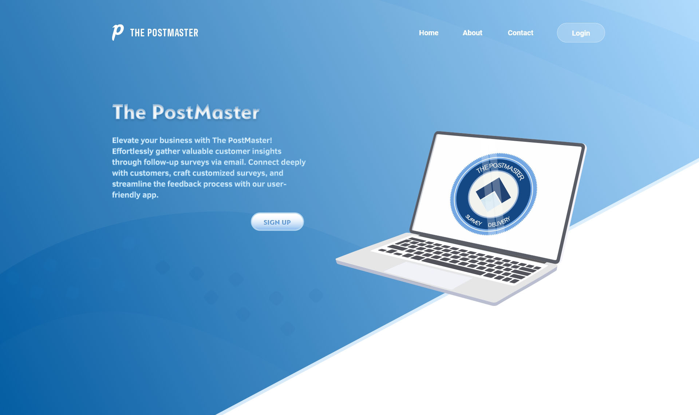

# The Post Master

# 

|  | .jpg) |
|--|--|
| .jpg) | .jpg) |
|  | .jpg) |
| .jpg) | .jpg) |
| .jpg) | .jpg)
| .jpg) | .jpg)

# The PostMaster

The PostMaster is a simple app designed to facilitate the process of gathering feedback from customers through email surveys. Built using the MERN stack, and integrates with Stripe for fictional credit card transactions and SendGrid for email handling and webhooks.

## Getting Started

To use the live version hosted on Heroku, simply [click here](https://gruesome-grave-12486.herokuapp.com/) to access the app. Create a username and password to get started. Use the provided test credit card number `4242 4242 4242` to add credits to your account via Stripe. Please note that this is a test application, so avoid using real credit/debit information.

### Local Setup

To use the use from a cloned downloaded repository, clone or download the repository. Make sure you have Node.js, and React installed on your machine. You will then need to create a MongoDb connection. You can do it  locally on your machine or do what I did and use https://cloud.mongodb.com/. You will then need to sign up for a SendGrid account https://sendgrid.com/. The free tier should be just fine. You will then need an API key from SendGrid. Copy this key and paste it in the dev-sample.js file which is located in the config folder in the "sendGridKey" value.

Before you continue, rename the dev-sample.js file in the config folder to dev.js.

To be able to use webhooks in a local environment, you will need Ngrok. We can use npx to run ngrok and have it forward traffic to whatever port you set for Express.js without installing anything. To do this, open a brand new terminal and run:

    npx ngrok http (your express.js port)

This will launch up a pop-up window with the address you can use:

This address that was generated, in this case: https://241db4487f27.ngrok.io will only exist for 2 hours. You'll want to keep this terminal session open and running while you are developing. If you close the running ngrok session and re-run npx ngrok http (your express.js port), the address will be different. It is important to remember these two things as you will likely need to update the ngrok generated address in your Sendgrid dashboard a few times through the development process.

## Sendgrid Integration

You will need to adding your Ngrok address to the Event Notification's HTTP POST URL field.  you'll want to paste the current session's address into this field:

Anytime you start a new ngrok session, you'll need to update this HTTP POST URL field. You should be able to then click the "Test Your Integration" button. If it's working, you might get some data from Sendgrid or an error in your terminal like this:

    [0] TypeError [ERR_INVALID_URL]: Invalid URL: undefined

This is fine, as it does prove the integration is working and is sending data through ngrok to your application. The Ngrok session are for development only. These tools only serve to allow Sendgrid to post back to your application running on localhost. If you were to deploy your finished application to Heroku and users filled out a survey, the Sendgrid integration for click tracking would post directly to your Heroku application at https://your_heroku_url/api/surveys/webhooks

## Stripe Setup
To be able to use the Stripe Api that's needed for the fictional payments use will need to sign up at stripe.com to obtain an API key. Once you sign up click on the Api link
on the left tab. You should be presented with two keys an Publishable key, and a Secret key. The publishable key that identifies our application to Strype and it is used on the front end of our application. Add both of these keys to the dev.js file mentioned earlier.

## Recent Updates

### New Features:

- **Modern UI Design**: The app has been completely redesigned with a modern look and feel to enhance user experience.
- **Graphical Survey Results**: Visualize survey responses with dynamic graphs to track feedback trends more effectively.
- **Survey Search Functionality**: Easily search for specific surveys using the new search feature.
- **User and Company Profiles**: Create and manage user or company profiles for personalized interaction.
- **Light and Dark Mode**: Toggle between light and dark mode to suit your preference and reduce eye strain.

### Enhanced Functionality:

- **Profile Creation**: Users can now create profiles to access advanced features such as email list management.
- **Email List Management**: Create, edit, and delete email lists for targeted survey distribution.
- **Improved Accessibility**: Light and dark mode options improve accessibility and user comfort during extended usage.

### Prerequisites

A localhost Node.js, React.js installed on your machine

## Built With

* [MongoDb]
* [Express.js]
* [React.js]
* [Node.js]
