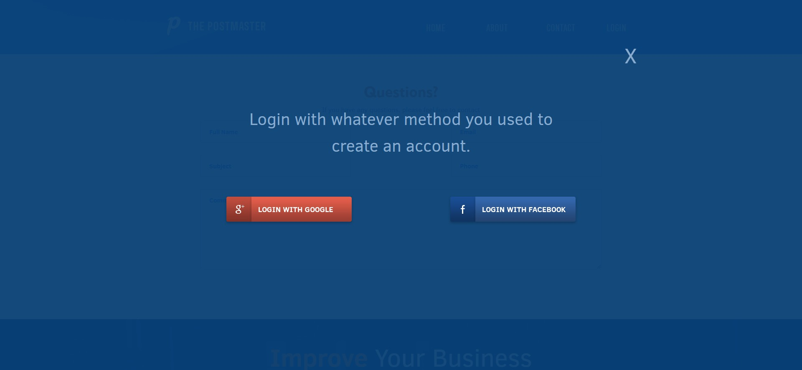
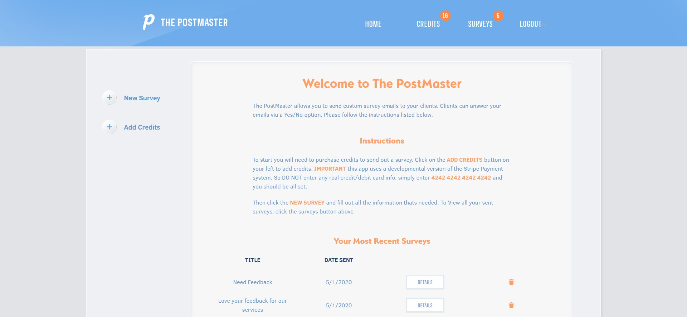
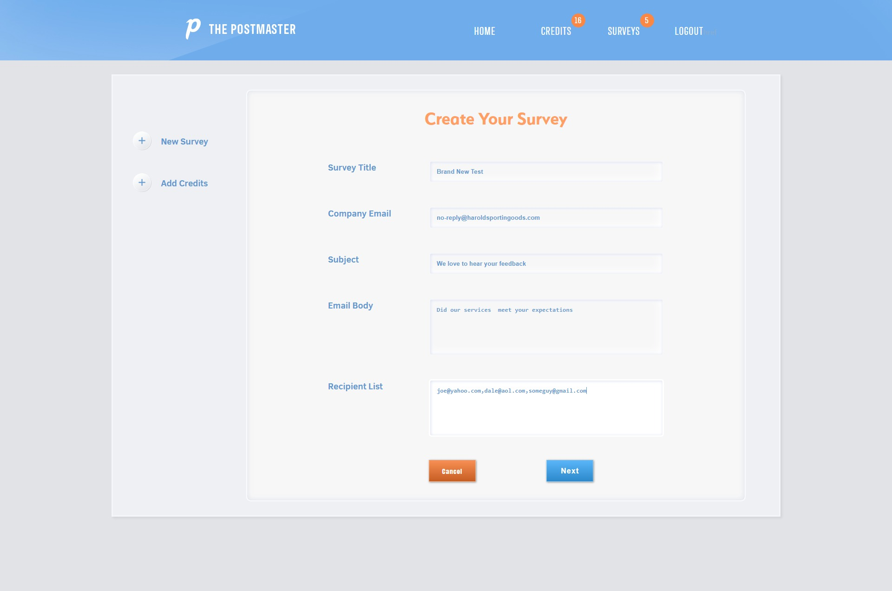
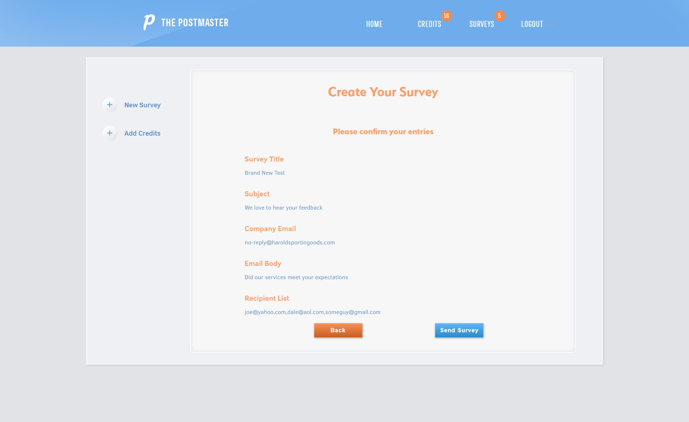

# The Post Master

# 

|  |  |
|--|--|
|  |  |

This is very simple app that a user can use to send out email-surveys to customers to and get feedback. This was built using the MERN stack. In addition the allow uses other libraries, such as Stripe to process fictional credit card purchases, and SendGrid to handle emails, and webhooks. To use the live version that is on Heroku click this link https://gruesome-grave-12486.herokuapp.com/ and them simply login with a Google, or Facebook account. To add credits to a fictional account using Stripe, simply use the numbers (4242 4242 4242). This will enable you to test out the application.

### Prerequisites

A localhost Node.js, React.js installed on your machine

## Built With

* [MongoDb]
* [Express.js]
* [React.js]
* [Node.js]
