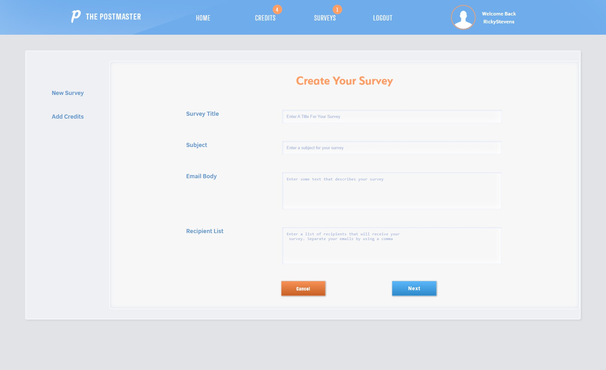

# The Post Master

# 

|  |  |
|--|--|
|  |  |
|  |  |

This is very simple app that a user can use to send out email-surveys to customers to and get feedback. This was built using the MERN stack. In addition this also uses other libraries, such as Stripe to process fictional credit card purchases, and SendGrid to handle emails, and webhooks. To use the live version that is on Heroku click this link https://gruesome-grave-12486.herokuapp.com/ and them simply create a username and password. To add credits to your account using Stripe, simply use the numbers (4242 4242 4242). This will enable you to test out the application. This is only a 
test application so do not use any real credit/debit info.

To use the use from a cloned downloaded repository, clone or download the repository. Make sure you have Node.js, and React installed on your machine. You will then need to create a MongoDb connection. You can do it  locally on your machine or do what I did and use https://cloud.mongodb.com/. You will then need to sign up for a SendGrid account https://sendgrid.com/. The free tier should be just fine. You will then need an API key from SendGrid. Copy this key and paste it in the dev-sample.js file which is located in the config folder in the "sendGridKey" value.

Before you continue, rename the dev-sample.js file in the config folder to dev.js.

To be able to use webhooks in a local environment, you will need Ngrok. We can use npx to run ngrok and have it forward traffic to port 5000 without installing anything. To do this, open a brand new terminal and run:

    npx ngrok http 5000

This will launch up a pop-up window with the address you can use:

This address that was generated, in this case: https://241db4487f27.ngrok.io will only exist for 2 hours. You'll want to keep this terminal session open and running while you are developing. If you close the running ngrok session and re-run npx ngrok http 5000, the address will be different. It is important to remember these two things as you will likely need to update the ngrok generated address in your Sendgrid dashboard a few times through the development process.

## Sendgrid Integration

You will need to adding your Ngrok address to the Event Notification's HTTP POST URL field.  you'll want to paste the current session's address into this field:

Anytime you start a new ngrok session, you'll need to update this HTTP POST URL field. You should be able to then click the "Test Your Integration" button. If it's working, you might get some data from Sendgrid or an error in your terminal like this:

    [0] TypeError [ERR_INVALID_URL]: Invalid URL: undefined

This is fine, as it does prove the integration is working and is sending data through ngrok to your application. The Ngrok session are for development only. These tools only serve to allow Sendgrid to post back to your application running on localhost. If you were to deploy your finished application to Heroku and users filled out a survey, the Sendgrid integration for click tracking would post directly to your Heroku application at https://your_heroku_url/api/surveys/webhooks

## Stripe Setup
To be able to use the Stripe Api that's needed for the fictional payments use will need to sign up at stripe.com to obtain an API key. Once you sign up click on the Api link
on the left tab. You should be presented with two keys an Publishable key, and a Secret key. The publishable key that identifies our application to Strype and it is used on the front end of our application. Add both of these keys to the dev.js file mentioned earlier.

### Prerequisites

A localhost Node.js, React.js installed on your machine

## Built With

* [MongoDb]
* [Express.js]
* [React.js]
* [Node.js]
